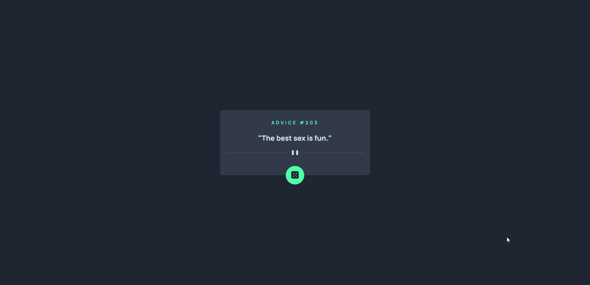
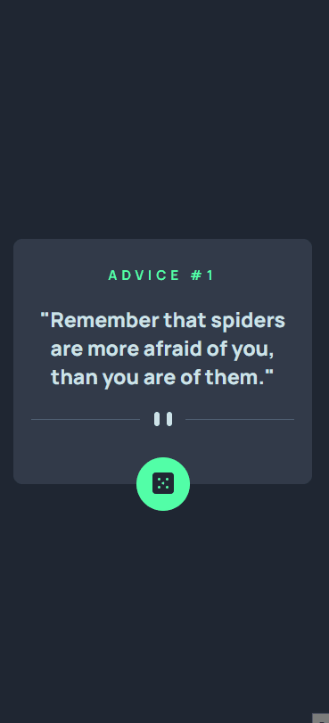

# Frontend Mentor - Advice generator app solution

This is a solution to the [Advice generator app challenge on Frontend Mentor](https://www.frontendmentor.io/challenges/advice-generator-app-QdUG-13db). Frontend Mentor challenges help you improve your coding skills by building realistic projects.

## Table of contents

- [Overview](#overview)
  - [The challenge](#the-challenge)
  - [Screenshot](#screenshot)
  - [Links](#links)
- [My process](#my-process)
  - [Built with](#built-with)
  - [What I learned](#what-i-learned)
  - [Continued development](#continued-development)
  - [Useful resources](#useful-resources)
- [Author](#author)
- [Acknowledgments](#acknowledgments)

## Overview

### The challenge

Users should be able to:

- View the optimal layout for the app depending on their device's screen size
- See hover states for all interactive elements on the page
- Generate a new piece of advice by clicking the dice icon

### Screenshot

- Desktop version

- Mobile version

### Links

- Live Site URL: [Live site at GitHub-Pages]()

## My process

### Built with

- Responsive 
- Javascript
- React
- Styled Components

### What I learned

In this project i was able to learn how to build a basic react app and get used to components, as well as, how to style everything with styled-components.

### Continued development

With this project i want be more familiarize with react projectand how to optimize it, and want to continue to get better with styled-components, now that i see what it can do. 

### Useful resources

- [W3Schools](https://www.w3schools.com/)
- [MDN Web Docs](https://developer.mozilla.org/en-US/)
- [Dev em Dobro](https://github.com/devemdobro)

## Author

- Github - [viniciusmontibeller](https://github.com/viniciusmontibeller)
- Frontend Mentor - [@viniciusmontibeller](https://www.frontendmentor.io/profile/viniciusmontibeller)

## Acknowledgments

I got to say that i'm really happy to be studying with the lessons by [Dev em Dobro](https://github.com/devemdobro). I started with zero programing skills and now i can see that i'm growing little by little into what i wanted to be.